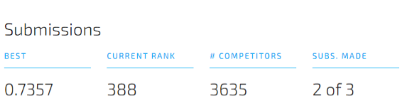

# Earthquake Damage Predictor

A data science contest, where we predict the damage caused by an earthquake on various structures. It is also one of the capstone project I submitted for the HarvardX Data Science certificate. 

This project consists of various R notebooks (broken into modules) and a pdf summary report was created using RMarkdown (see the Reports directory for details). 

Our model, a random forest created using the filtered dataset (see report for details) placed in the top 400, or the 11th percentile among all submissions.  

The datascience contest was hosted by drivendata, they supplied the training set, training values, and a testset. 